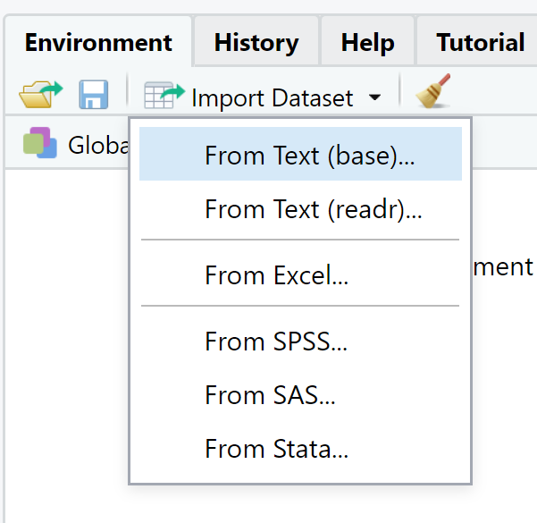
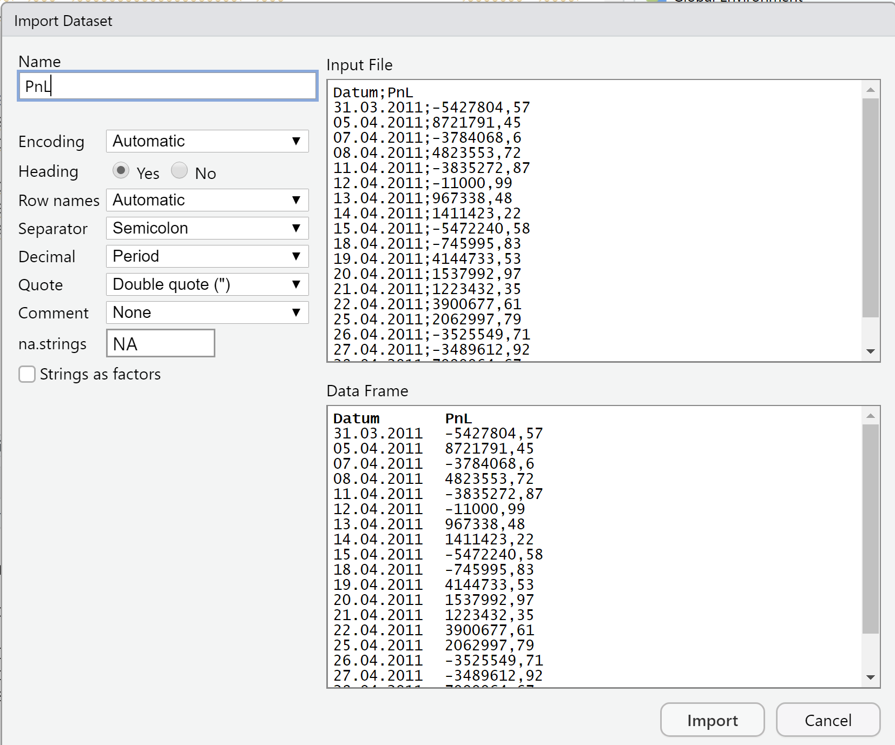
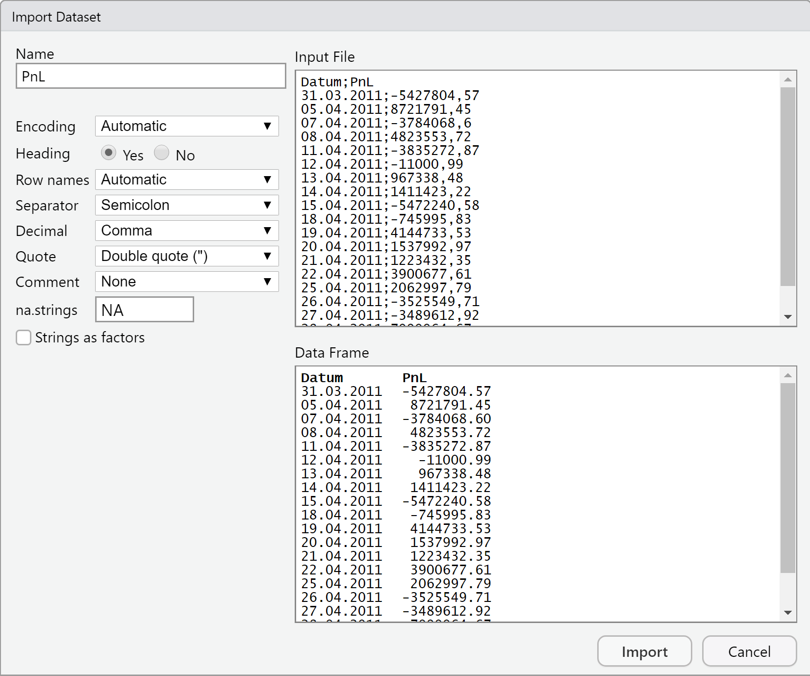

```{r setup, include=FALSE}
library(learnr)
knitr::opts_chunk$set(echo = FALSE)
```

## Allgemeines zum Datenmanagement

Am Beginn jeder Datenanalyse stehen die Daten selber. Bevor diese analysiert werden können, müssen diese zunächst in einer maschinenlesbaren Form beschafft und mit dem verwendeten Analyseprogramm eingelesen werden. Anschließend ist meist noch eine Konvertierung der eingelesenen Daten in die für die Analyse benötigten Datentypen nötig.

> Ein Praxishinweis: Auch wenn die Datenvorverarbeitung nicht zum Kern der Datenanalyse gehört, ist sie dennoch ein häufiger Fehlerquell und oft wird deutlich mehr Zeit darauf verwendet als ursprünglich eingeplant.

### Dateiformate

Grundsätzlich sind alle Daten maschinenlesbar, die in digitaler Form z.B. als Excel-Datei vorliegen. Damit die in einer Datei enthaltenen Informationen sinnvoll verwendet werden können, benötigt der Computer allerdings Informationen über die Struktur der Daten.

Einen ersten Hinweis auf die Struktur der Daten gibt der Dateityp bzw. das Dateiformat - welches üblicherweise bereits durch die Dateiendung kenntlich gemacht wird. Beispiele sind `.xlsx` für Excel-Dateien, `.txt` für Textdateien oder `.csv` für mit Kommazeichen abgetrennte Datentabellen (engl. comma separated values).

Das Dateiformat gibt den darin enthaltenen Daten eine Struktur vor. Betrachten wir die für Datenanalysen häufig verwendeten Datentabellen so besteht deren Struktur aus einer Matrixform mit Zeilen und Spalten. Jede Zeile enthält die Daten einer Beobachtung - auch als einzelner Datensatz bezeichnet - und jede Spalte enthält für ein bestimmtes Merkmal die Beobachtungen dieses Merkmals in allen Datensätzen. Diese Struktur wird im Dateiformat für gewöhnlich charakterisiert durch:

* Mehrfache Zeilen mit einer gleichbleibenden, festen Anzahl voneinander abgetrennter Einträge für die Spalten
* einem festgelegten Zeichen für das Zeilenende
* einem festgelegten Trennungszeichen für die Spaltenaufteilung
* ggf. einer ergänzenden Titelzeile mit Spaltenüberschriften
* ggf. einer ersten Spalte für die Zeilennummerierung
* Sonderkennzeichnungen für bestimmte Wertformate, z.B.
  + ein Dezimaltrennzeichen für numerische Werte
  + ein Zitierungszeichen für Texteinträge (engl. quotation)

Sofern bei der Strukturierung der Daten keine strengen Standards gelten müssen diese Informationen beim Einlesen einer Datei mit angebeben werden, damit die Zeichenketten in der Datei sinnvoll interpretiert werden können.

### Zeichenkodierung 

Neben der groben Strukturierung der Daten z.B. in Zeilen und Spalten gibt es mit der Zeichenkodierung eine feinere Information zu den einzelnen Zeichen.

Grundsätzlich werden maschinenlesbare Daten digital gespeichert, d.h. als Folge von Bites bestehend aus einer Null oder einer  Eins. In der Regel fasst man acht digitale Zeichen zu einem Byte zusammen. Ein Byte hat $2^8 = 256$ mögliche Werte. 

Unter Zeichenkodierung (engl. encoding) versteht man nun die Zuordnung einer Bit bzw. Bytefolge zu einem für uns Menschen sinnvollen Zeichen wie z.B. einem Buchstaben oder einem Sonderzeichen.  Leider gibt es für die Zeichenkodierung keinen allumfassenden Standard. Denn je nach Sprachraum existieren unterschiedliche Alphabete und damit Zeichenkodierungen. Im deutsch- und englischsprachigen Raum sind vor allem zwei Formate verbreitet:

* Unicode Transformation Format (UTF) - je nach Länge der verwendeten Bitfolge z.B. als UTF-8, UTF-16 oder UTF-32 bezeichnet
* ISO 8859-1 bzw. ISO Latin-1 für eine auf westeuropäische Sprachen optimierte Kodierung von Bitfolgen der Länge acht

Damit der Computer die Bit- bzw. Bytefolgen einer Datei richtig interpretiert, muss die verwendete Zeichenkodierung angegeben werden.

### Länderkonventionen

Zusätzlich zur Zeichenkodierung gibt es noch weitere länderspezifische Konventionen. Der im Bereich der Datenanalyse häufigste Unterschied besteht in der Darstellung numerischer Werte:

* Im englischen Sprachraum wird traditionell die Dezimalstelle durch einen Punkt abgetrennt, Tausenderstellen durch ein Komma - z.B. 7,000.5 für die Zahl Siebentausendeinhalb.
* Im kontinentaleuropäischen Bereich verwendert man dagegen einen Punkt als Tausendertrennzeichen und ein Komma als Dezimaltrennzeichen - z.B. 7.000,5 für die Zahl Siebentausendeinhalb.
* In anderen Sprachräumen werden Ziffern nicht durchweg in $10^3$er Folgen also als Tausender, Million, ... gruppiert. Im indischen Zahlensystem gruppiert man bspw. nur die ersten drei Stellen, anschließend immer zwei Stellen und kodiert dies durch ein hochgestelltes Komma so z.B. 10\'00\'000 für eine Million.
* Im englischen Sprachraum wird häufig bei Bruchteilen eines Ganzen die Angabe der Null vor dem Dezimaltrennzeichen weggelassen - so z.B. .25 statt 0.25.

Neben der Kodierung von Zahlenwerten gibt es insbesondere bei der Kodierung von Datum- und Zeitangaben deutliche länderspezifische Eigenheiten.

* In Deutschland verbreitet ist die Angabe des Datums in der Reihenfolge Tag, Monat, Jahr getrennt durch Punkte und wahlweise mit oder ohne führende Nullen, sowie die Angabe der Zeit im 24-Stunden Format mit Stunden, Minuten getrennt durch einen Doppelpunkt
* Im US-amerikanischen Gebrauch werden Daten dagegen für gewöhnlich in der Reihenfolge Jahr, Monat, Tag getrennt durch Bindestriche angegeben und Uhrzeiten im 12-Stunden Format mit Stunden, Minuten getrennt durch einen Doppelpunkt und dem Zusatz am für den Vormittag (latein. ante meridiem) bzw. Nachmittag pm (post meridiem)

Derartige Informationen zum verwendeten Zahlenformat müssen beim Einlesen von Daten korrekt angegeben werden.

## Date(ie)n in R einlesen 
R bietet in der Basisfunktionalität bereits verschiedene Funktionen, um in einer Datei gespeicherte Daten einzulesen:

* mit `readLines()` können beliebige Dateien zeilenweise eingelesen werden
* mit `read.table()` können Datentabellen eingelesen werden

Für Datenanalysen werden meistens strukturierte Daten verwendet, die in Tabellenform vorliegen. Nur diese werden im Folgenden behandelt. 

### Datentabellen einlesen mit `read.table()`

Die Funktion `read.table()` erlaubt das Einlesen von Daten in Tabellenformat und akzeptiert eine Vielfalt an unterschiedlichen Strukturen und Konventionen, welche durch Argumente festgelegt werden.

Notwendig ist stets die Angabe des Argument `file = ` welches relativen Pfad und Dateinamen als `character` angibt (akzeptiert auch URLs).
Darüberhinaus gibt es eine Vielzahl weiterer Argumente. Die wichtigsten:

* `header = ` Angabe, ob die erste Zeile Spaltenüberschriften beinhaltet (`TRUE`) oder nicht - Standard ist `FALSE`
* `sep = ` Spaltentrennzeichen - Standard ist Leerzeichen bzw. Tabulator
* `quote= ` Zitierungszeichen für Texteinträge - Standard ist das doppelte Anführungszeichen \"
* `dec = ` Dezimaltrennzeichen - Standard ist der Punkt
* `skip =` Anzahl der Zeilen zu Beginn der Datei, die beim Einlesen ignoriert werden - Standard ist 0
* `encoding = ` Zeichenkodierung - Standard ist die Systemeinstellung des Computers und damit i.d.R. UTF-8 oder Latin-1

Für häufig verwendete Formatierungskombinationen bietet R Kurzfassungen an:

* `read.csv()` entspricht `read.table( , header=TRUE, sep=",", dec=".")`
* `read.csv2()` entspricht `read.table( , header=TRUE, sep=";", dec=",")`

### Datentabellen einlesen mit der RStudio GUI

Neben der direkten Eingabe des Funktionsaufrufs von `read.table()` lassen sich Daten in der RStudio Benutzeroberfläche manuell auch komfortabel über einen Benutzerdialog einlesen.

Dazu wählt man im Reiter `Environment` den Menüpunkt `Import Dataset` aus.
Der Eintrag `Read from text (base)` verwendet `read.table()`. Die anderen Einträge verwenden Einlesefunktionen aus dem sogenannten `tidyverse`, welche hier (noch) nicht besprochen werden.
{height=100px}


`Read from text (base)` bietet zunächst die Auswahl der Datei über ein Explorerfenster. Anschließend werden in einem interaktiven Dialogfenster die Struktur der Daten und damit die Argumente von `read.table()` festgelegt.

Zu Beginn startet RStudio mit schon leicht auf die Datei angepassten Standardwerten:
{height=400px}

Im vorliegenden Fall einer Zeitreihe mit Gewinnen und Verlusten (engl. Profits and Losses oder PnL) muss für einen erfolgreichen Import lediglich noch das Dezimaltrennzeichen angepasst werden
{height=400px}

Nach Klicken auf `Import` werden die Daten eingelesen und mit dem `View()` Befehl in der RStudio Benutzerumgebung angezeigt. Der dabei verwendete Funktionsaufruf wird in der Konsole ausgegeben. Im Beispiel ist dies:

```{r , exercise=F ,eval=T, echo=T}
PnL <- read.csv2("../data/PnL.csv")
### entspricht read.table("./PnL.csv", header=TRUE, sep=";", dec=",")
```


### Exceltabellen einlesen mit `read.xlsx()`

Durch Erweiterung der Basisfunktionalitäten kann R auch Daten im Excel-Dateiformat `.xls` einlesen. Hier betrachten wir die Funktionalitäten des Paketes `openxlsx`. (Installation und dem Einbinden des Pakets auf einer lokalen R-Installation werden im nachfolgenden Abschnitt erklärt). )

```{r, echo = F, eval = T}
library("openxlsx")
```

Die Hauptfunktion des Paketes, `read.xlsx()`, akzeptiert neben der obligatorischen Angabe des Pfades und Dateinamens unter dem Argument `xlsxFile = ` weitere Argumente, um die Struktur der Excel-Datei zu spezifizieren - unter anderem:

* `sheet = ` Angabe des einzulesenden Tabellenblattes als Nummer oder mit Name - Standard ist das erste Blatt
* `startRow = ` Erste Zeile der einzulesenden Datentabelle - Standard ist der Wert 1
* `colNames = ` enthält die erste Zeile Spaltennamen - Standard ist `TRUE`
* `detectDates = ` Abfrage, ob versucht werden soll, Datumsangaben als solche zu erkennen und einzulesen - Standard ist `FALSE`

Im Gegensatz zu allgemeinen Datentabellen z.B. mit dem Format `.csv` beinhaltet das `.xlsx` Format bereits wesentliche Angaben zur Zeichenkodierung und Zahlendarstellung. Diese müssen und können daher beim Einlesen nicht weiter spezifiziert werden.

### Übung 

> Aufgrund der notwendigen Interaktion mit dem Dateisystem kann diese Übung nicht auf dem Server durchgeführt werden. Verwenden Sie bitte Ihre lokale R-Installation.

***Kleine Übung***

Bearbeiten Sie die folgende Aufgabenstellung:
* Laden Sie die Datei `PnL.csv` aus dem Moodle-Kursraum runter
* Lesen Sie die Datei mit Hilfe der Funktion `read.table()` oder über die Benutzeroberfläche RStudio ein
* Achten Sie auf die korrekte Formatierung der enthaltenen Zahlenwerte!
* Berechnen Sie die Summe aller Gewinne und Verluste in der Spalte `PnL` mit der Funktion `sum()`

Vergleichen Sie Ihr Ergebnis mit der Lösung: 51296207,5

## Exkurs: Pakete in R

R verfügt bereits in der Basisfunktionalität über einen umfangreichen Funktionsumfang. Dieser lässt sich durch das Einbinden zusätzlicher Pakete flexibel erweitern. Die Pakete werden von der Gemeinschaft der R Entwickler entwickelt und gepflegt. Sie werden als Open-Source bereitgestellt und lassen sich in R einfach einbinden. Eine Übersicht findet sich z.B. unter <https://ftp.gwdg.de/pub/misc/cran/web/packages/index.html>


Zum Installieren und Einbinden von Paketen in R werden die Funktionen `install.packages()` und `library()` verwendet.
In der Regel werden die Pakete in einem Unterverzeichnis des Benutzerordners installiert - Administratorenrechte sind nur für eine systemweite Installation notwendig. Die Pakete werden getrennt nach Versionsnummer der verwendeten R Version gespeichert, damit  sicher gestellt ist, dass Pakete und R Basisversion stets zueinander kompatibel sind - umgekehrt bedeutet das aber auch, dass man nach jedem größeren Update von R auch alle Pakete neu installieren muss.

Pakete können aufeinander aufbauen bzw. gegenseitige Abhängigkeiten aufweisen. R verfügt über eine eingebaute Verwaltung von Paketabhängigkeiten. Das bedeutet, dass bei der Installation eines neuen Paketes automatisch überprüft wird, ob weitere Pakete installiert werden müssen. Sofern das der Fall ist, installiert R die notwendigen Pakete automatisch mit.

Im folgenden zeigen wir beispielhaft, wie sich das Paket `openxlsx` installieren lässt, welches für das Einlesen und Schreiben von Dateien im EXCEL-Format benötigt wird. 

```{r, echo = T, eval = F}
install.packages("openxlsx") #Dateien werden heruntergeladen und lokal gespeichert
library("openxlsx") # Das Paket wird in die aktuelle R Umgebung geladen und die enthaltenen Funktionen bereit gestellt
```


## Kontrolle und Nachbearbeitung

Durch das Einlesen der Daten in R wird zunächst eine Variable erzeugt. In der Basisfunktionalität von R ist dies in der Regel eine Datentabelle, d.h. vom Typ `data.frame`.

Bevor man mit der Analyse der Daten beginnt, sollten diese zunächst überblickartig auf Korrektheit kontrolliert und ggf. nachbearbeitet werden.

### Überblick über eingelesene Datensätze

In Rstudio lassen sich Datensätze mit der Funktion `View()` in einem eigenen Fenster als Tabelle anzeigen und die enthaltenen Datensätze nach eigenen Kriterien filtern. Dies dient einer ersten visuellen Kontrolle.

Insbesondere bei sehr großen Datensätzen ist eine visuelle Kontrolle aber rechen- und zeitaufwändig. Auf Ebene der Kommandozeile lässt sich eine übersichtsartige Kontrolle mit Hilfe folgender Funktionen durchführen:

(@) mit den Funktionen `head()` und `tail()` lassen sich die ersten bzw letzten fünf Zeilen der Tabelle ausgeben

```{r , exercise=F ,eval=T, echo=T}
head(PnL)
tail(PnL)
```
(@) die Funktion `str()` zeigt die R-interne Struktur an - Dimension, Datentypen,...

```{r , exercise=F ,eval=T, echo=T}
str(PnL)
```

(@) die Funktion `summary()` zeigt statistische Informationen zu den Variablen bzw. Spalten der Tabelle an

```{r , exercise=F ,eval=T, echo=T}
summary(PnL)
```


### Daten transformieren

Häufig verfügen die eingelesenen Daten noch nicht über das gewünschte Format, d.h. die Spalten der Datentabelle haben noch nicht den richtigen Datentyp (vgl. Lerneinheit zu Grunglagen R).

Zur Konvertierung des Datentyps bietet R verschiedene Funktionen. Bereits vorgestellt wurde die Funktion `as.data.frame()`, mit der eine Matrix in eine Datentabelle konvertiert werden kann. 


Andere gebräuchliche Konvertierungsfunktionen sind

* `as.factor()` zur Umwandlung eines `character` Vektors in einen `factor` 
* `as.Date()` zur Umwandlung eines `character` in ein Kalenderdatum

Als Beispiel dient uns hier der Datensatz zu Gewinnen und Verlusten aus dem vorherigen Abschnitt. Wie oben dargestellt wurde die Spalte `Datum` als `character`eingelesen. Ursächlich dafür ist das verwendete deutsche Datumsformat, das von R nicht automatisch erkannt wird. Diese Spalte soll nun mit der Funktion `as.Date()` in einen Datumsvektor transformiert werden. 

Die Funktion `as.Date()` greift zum Umwandeln auf eine Formatangabe zurück, die mit dem Argument `format = ` als `character` spezifiziert wird. Die Formatangabe ist eine Zeichenkette, in der zum Einen mit den Angaben `%d` der Tag, `%m` der Monat und `%y` das Jahr (zweistellig) bzw. `%Y` (vierstellig) die Position des Tages, Monats und Jahres respektive festgelegt wird und zum Anderen die verwendeten Trennzeichen mit übergeben werden.

Ausgangspunkt sind in diesem Fall Werte der Form 

```{r , exercise=F ,eval=T, echo=T}
PnL$Datum[1]
```

Übersetzt in das obige Schema ist die der Zeichenvektor `%d.%m.%Y`.
Der folgende Funktionsaufruf konvertiert damit den eingelesenen Wert in ein von R akzeptiertes Datum.

```{r , exercise=F ,eval=T, echo=T}
as.Date(PnL$Datum[1], format = "%d.%m.%Y")
```

Man erkennt die erfolgreiche Datentransformation an der veränderten Ausgabe, welche jetzt dem von R verwendeten US-amerikanischen Datumsformat Jahr-Monat-Tag entspricht.

Um nicht nur ein einzelnes Datum zu transformieren, wenden wir die Funktion auf die ganze Spalte an, und speichern das Ergebnis gleich wieder in der Datentabelle.

> Achtung: Durch das Überschreiben der ursprünglichen Variable werden die dort bislang gespeicherten Daten unwiderruflich überschrieben. Machen Sie dies nur, wenn Sie sicher sind, dass dies korrekt ist. Ansonsten müssen Sie die Daten wieder neu einlesen.

```{r , exercise=F ,eval=T, echo=T}
PnL$Datum <- as.Date(PnL$Datum, format = "%d.%m.%Y")
```

Durch das Transformieren des Datums kann R die Spalte `Datum` nun auch in anderen Funktionen korrekt als Datum einbinden z.B. bei der grafischen Darstellung:

```{r , exercise=F ,eval=T, echo=T}
plot(PnL)
```

Ohne weitere Zusatzangabe formatiert R beim Aufruf der Funktion `plot()` die Datumsspalte auf der x-Achse nun als Datumsangabe und verwendet abgekürzte Monatsnamen zur Achsenbeschriftung.


***Kleine Übung***

Bearbeiten Sie die folgende Aufgabenstellung in Ihrer lokalen R Installation
* Transformieren Sie die Spalte Datum mit der Funktion `as.Date()` als Datumsvektor in R
* Stellen Sie die Gewinne und Verluste grafisch dar - allerdings nur für die Monate September und Oktober


## Daten lokal speichern

Umgekehrt zum Einlesen von Daten bietet R bereits in der Basisfunktionalität vielfältige Möglichkeite, Daten lokal in eine Datei zu schreiben. 

* mit `writeLines()` kann beliebiger Text in eine Datei geschrieben werden
* mit `write.table()` können Datentabellen geschrieben werden

### Datentabellen als Textdatei speichern mit `write.table()`

Die Funktion `write.table()` erlaubt das Schreiben von Daten in Tabellenformat, bei dem durch die Argumente der Funktion eine Vielfalt an unterschiedlichen Strukturen und Konventionen festgelegt werden kann.

Notwendig ist stets die Angabe des Arguments `x = ` für den Variablennamen der abzuspeichernden Datentabelle und des Arguments `file = ` welches relativen Pfad und Dateinamen der Zieldatei als `character` angibt.
Darüberhinaus gibt es eine Vielzahl weiterer Argumente. Die wichtigsten:

* `append = ` Angabe, ob die Tabelle an bereits bestehende Einträge in der Datei hinten herangehängt werden soll (engl. append) - Standard ist `FALSE`, womit alle bestehenden Einträge in der Zieldatei gelöscht bzw. überschrieben werden
* `sep = ` Spaltentrennzeichen - Standard ist Leerzeichen bzw. Tabulator
* `quote= ` sollen Texteinträge durch ein Zitierungszeichen eingefasst werden - Standard ist `TRUE` 
* `dec = ` Dezimaltrennzeichen - Standard ist der Punkt
* `eol = ` Zeilenendzeichen (engl. end of line) - Standard ist der Zeilenumbruch 

Für häufig verwendete Formatierungskombinationen bietet R Kurzfassungen an:

* `write.csv()` entspricht `write.table( , sep=",", dec=".")`
* `write.csv2()` entspricht `write.table( , sep=";", dec=",")`

### Datentabellen als Excel-Datei speichern mit `write.xlsx()`

Die Funktion `write.xlsx()` stellt das Spiegelbild zu `read.xlsx()` dar. Notwendig sind die Angabe des Arguments `x = ` für den Variablennamen der abzuspeichernden Datentabelle bzw. des zu speichernden Objekts und des Arguments `file = ` welches relativen Pfad und Dateinamen der Zieldatei als `character` angibt.

Darüberhinaus dienen weitere Argumente, um die Struktur der Excel-Datei zu spezifizieren - unter anderem:

* `asTable = ` Angabe ob die Daten als Tabelle geschrieben werden sollen - Standard ist `FALSE`

Neben dem Speichern einer einzelnen Datentabelle akzeptiert `write.xlsx()` unter dem Argument `x = ` auch eine Liste mit Datentabellen. Diese werden dann in jeweils eigene Datenblätter der Excel-Datei geschrieben. 

Beispielhaft sichern wir nun die Daten zu Gewinnen und Verlusten mit der jetzt als Datum formatierten Spalte `Datum` als Excel-Datei

```{r , exercise=F ,eval=F, echo=T}
write.xlsx(PnL, file= "PnL_neu.xlsx")
```


***Kleine Übung***

Bearbeiten Sie die folgende Aufgabenstellung in Ihrer lokalen R Installation

* Installieren Sie das Paket `openxlsx` mit der Funktion `install.packages()` und binden Sie es mit der Funktion `library()` ein
* Speichern Sie den Datensatz `PnL` mit der als Datum transformierten Spalte `Datum` mit der Funktion `write.xlsx()` als Excel-Datei ab
* Öffnen Sie die neu erstellte Daten mit Excel oder einer anderen Tabellenkalkulation, vergleichen Sie die Werte mit der ursprünglichen Datei `PnL.csv` und beachten Sie die Zellformatierung in der Spalte `Datum`


## Quiz
Ein paar Fragen, um das Verständnis der Lehrinhalte zu überprüfen.

```{r quiz}
quiz(
  question("Was versteht man unter einer Zeichenkodierung?",
    answer("Die Eingabe von Zeichen zum Erstellen von Programmcode."),
    answer("Die Übersetzung von Bits/Bytes in Zeichen.", correct = TRUE),
    answer("Unterschiedliche Datumsformate wie z.b. dd.mm.jj"),
    answer("Die unterschiedlichen Darstellungsformen von Punkten als Zeichen in Plots.")
  ),
  question("Welche Argumente dienen in `read.table()` zum Festlegen der Formatierung? ",
    answer("`file`"),
    answer("`skip`"),
    answer("`dec`", correct = TRUE),
    answer("`sep`", correct = TRUE)
  ),
   question("Wieso ist eine Kontrolle der Daten nach dem Einlesen wichtig?",
    answer("Weil beim Einlesen Fehler passieren können.", correct = TRUE),
    answer("Um Nachbearbeitungsbedarf zu identifizieren.", correct = TRUE),
    answer("Um einen ersten Überblick über die Daten zu kriegen.", correct = TRUE),
    answer("Vertrauen ist gut, Kontrolle ist besser.", correct = TRUE)
  )
)
```

