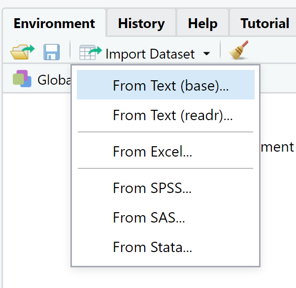
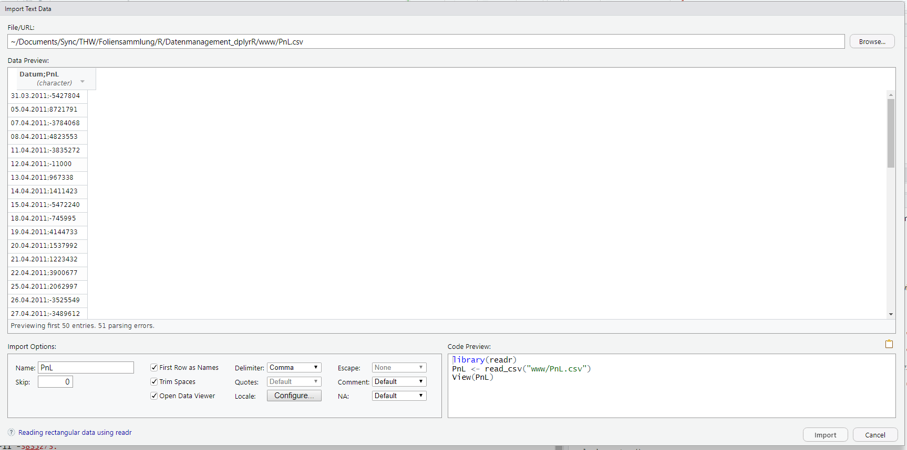
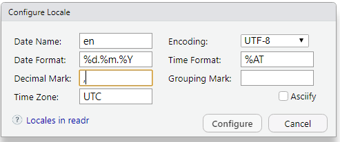
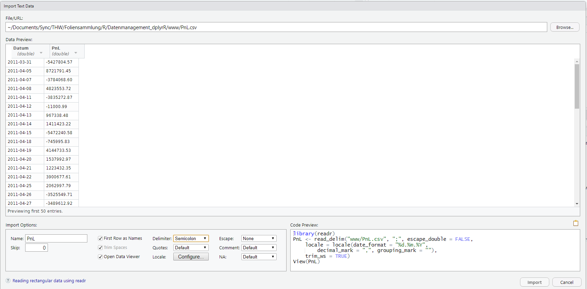

 <p xmlns:cc="http://creativecommons.org/ns#" xmlns:dct="http://purl.org/dc/terms/"><a property="dct:title" rel="cc:attributionURL" href="https://git.th-wildau.de/r3/Datenmanagement_tidyR">Datenmanagement mit R (tidy)</a> by <a rel="cc:attributionURL dct:creator" property="cc:attributionName" href="https://www.th-wildau.de/rainer-stollhoff/">Rainer Stollhoff</a> is licensed under <a href="http://creativecommons.org/licenses/by-sa/4.0/?ref=chooser-v1" target="_blank" rel="license noopener noreferrer" style="display:inline-block;">CC BY-SA 4.0</a></p>

```{r setup, include=FALSE}
library(learnr)
library(dplyr)
library(readr)
library(readxl)
library(writexl)
library(ggplot2)
knitr::opts_chunk$set(echo = FALSE)
```

## Allgemeines

### Basisfunktionalität und Erweiterungen

Bereits in der Basisfunktionalität bietet R Möglichkeiten, um Daten einzulesen und zu transformieren. Der Fokus der Funktionalität im Datenmanagement der Basisausstattung liegt in der Kompatibilität zu anderen Funktionen der Basisausstattung oder anderen Paketen. Die Kompatibilität geht allerdings zu Lasten der Geschwindigkeit und der Lesbarkeit der Befehlsaufrufe.

Als Erweiterung der Basisfunktionalität zum Datenmanagement haben sich in den letzten Jahren zwei Dialekte von R herausgebildet:

* `tidyverse` ist eine Erweiterung von R, die vom kommerziellen Unternehmen RStudio vorangetrieben wird und viele Pakete umfasst - insbesondere die Pakete `readr`, `readxl` und `dplyr` für Datenimport und -management. Der Fokus des `tidyverse` liegt auf einer einfacheren Lesbarkeit des Programmcodes durch Vewendung von Funktionsnamen und Syntax analog zur englischen Sprache.
* `data.table` ist ein Programmpaket für das Datenmanagement getragen von einer breiteren v.a. wissenschaftlichen Community. Der Fokus liegt auf einer schnellen Berechnung und einer klaren Syntax.

Die beiden unterschiedlichen Dialekte können zwar grundsätzlich parallel zueinander verwendet werden. Dies führt allerdings zu einem hohen Aufwand in der Programmierung und in der Berechnung - sofern die Daten in R von einer Darstellung zu einer anderen konvertiert werden müssen. Entsprechend entscheiden sich die meisten Programmierer in R für eine der beiden Dialektarten.

In diesem Kapitel sollen die Erweiterungen `readr`, `readxl` und `dplyr` aus dem `tidyverse` vorgestellt werden. Ein anderes Kapitel behandelt die Erweiterung `data.table`.

Für eine Gegenüberstellung der unterschiedlcihen Erweiterungen und der Basisfunktionalität siehe auch:

* [Blogbeitrag von J.Mercer mit einer Gegenüberstellung aller drei Varianten: baseR, tidyverse, data.table](https://wetlandscapes.com/blog/a-comparison-of-r-dialects/)
* [Blogbeitrag von Atrebas mit einer Gegenüberstellung von dplyr und data.table](https://atrebas.github.io/post/2019-03-03-datatable-dplyr/)
* [Webseite des tidyverse Projekts](https://www.tidyverse.org/)
* [Kritische Analyse des tidyverse von N.Matloff](https://github.com/matloff/TidyverseSkeptic/blob/master/READMEFull.md)

### Installation

Die Installation der Pakete erfolgt entweder separat


```{r, echo = T, eval = F}
install.packages(c("dplyr","readr","readxl")) 
library("dplyr")
library("readr")
library("readxl")
```


oder im Bündel mit allen anderen Paketen des tidyverse


```{r, echo = T, eval = F}
install.packages("tidyverse") 
library("tidyverse") 
```


### Hilfestellung und Referenz

Die Bibliotheken des `tidyverse` wurde von Hadley Wickham und einem Autorenkollektiv entwickelt. Mehr Informationen finden sich auf der [englischsprachigen Seite des Projekts](https://www.tidyverse.org/).

Eine Übersicht über die in `readr` implementierten Funktionen findet sich auch in diesem [data-import-cheatsheet ](./www/data-import.pdf).


Eine Übersicht über die in `dplyr` implementierten Funktionen findet sich auch in dem [data-transformation-cheatsheet](./data-transformation.pdf).

Aktualisierte Versionen finden sich unter: [Posit Cheatsheets](https://posit.co/resources/cheatsheets/?type=posit-cheatsheets&_page=1/)

### Verwendete Datensätze

Für die folgende Darstellung verwenden wir einen einfachen Datensatz in Tabellenform, in verschiedenen Dateiformaten:

* [PnL.csv](./www/PnL.csv)
* [PnL.xlsx](./www/PnL.xlsx)

## Date(ie)n in R einlesen mit `readr` 

Das Paket `readr` bietet verschiedene Funktionen, um in einer Datei gespeicherte Daten einzulesen:

* mit `read_...()` können Dateien in Tabellenform eingelesen werden z.B.
  + `read_csv()` mit Kommatrennung der Einträge 
  + `read_delim()` unter Angabe eines Trennzeichens mit dem Argument `delim =`
  + `read_fwf()` für feste Spaltenbreiten
* mit `read_file()` oder `read_lines()` werden beliebige Daten zeilenweise als Zeichenkette (`string`) eingelesen
  
Die lokalen Vorgänge zur Zeichenkodiereung, Dezimaltrennzeichen, etc. erfolgen dabei gemäß `locale()` - siehe nachfolgender Exkurs.

Betrachten wir den Datensatz in der Datei `PnL.csv`. Wir versuchen zunächst, die Daten direkt einzulesen:

```{r , exercise=F ,eval=T, echo=T}
library(readr)
PnL <- read_csv2("./www/PnL.csv")
```

Wie wir der Ausgabe entnehmen können, hat `readr` Dezimalzeichen und Tausendertrennzeichen automatisch angepasst. Die Werte für Gewinne und Verluste in der Spalte `PnL` werden daher korrekterweise als Zahlenwerte erkannt.

Mit den Funktionen `parse_...()` können auch nach dem Einlesen noch Datentypen erkannt und zugewiesen werden.

### Exkurs: Formatvorgaben auf Systemebene

Bei einer Installation von R werden üblicherweise Formatvorgaben für Zeichenkodierung, Zahlenformat, etc. festgelegt. In der Regel werden diese aus den Angaben des Betriebssystems ausgelesen.

Im `tidyverse`kann man sich mit dem Befehl `locale()` die in der aktuellen R Sitzung verwendeten Vorgaben anzeigen lassen.

```{r, echo = T, eval = T}
locale()
```

Allgemeinere Informationen erhält man auch mit

```{r, echo = T, eval = T}
Sys.getlocale()
# Sys.getenv()  #umfangreiche Informationen - hier nur kommentiert

```


### Spaltenformat

Die Funktionen `read_csv()`, `read_delim()`,... lesen Daten in Tabellenformat ein und konvertieren diese automatisch in passende Datentypen. In eingen Fällen führt die automatische Zuordnung jedoch zu Fehlern und es ist notwendig, das Spaltenformat explizit anzugeben.

Für den Datensatz in der Datei `PnL.csv` hatten wir beim direkten Einlesen folgendes erhalten:

```{r , exercise=F ,eval=T, echo=T}
PnL <- read_csv2("./www/PnL.csv")
```

Wie wir der Ausgabe entnehmen lönnen, hat `readr` Dezimalzeichen und Tausendertrennzeichen automatisch angepasst. Die Werte für Gewinne und Verluste in der Spalte `PnL` werden daher korrekterweise als Zahlenwerte erkannt. Anders bei den Datumsangaben in der ersten Spalte. Diese werden nicht als Datum erkannt, sondern nur als Zeichenkette (`character`).

Um die Spaltenformate manuell festzulegen, kann man den `read_...()` Funktionen das Argument `col_types = cols(...)` übergeben. Dabei muss für jede Spalte in der Datentabelle durch Aufruf des Spaltennamens und einem folgenden Befehlsaufruf der Datentyp festgelegt werden, darunter:

* `col_guess()` überlässt `readr` eine automatisierte Wahl - Standardeinstellung
* `col_character()` für Zeichenketten
* `col_integer()` für ganzzahlige Zahlenwerte
* `col_double()` für Zahlenwerte im Gleitkommaformat
* `col_date()` für Datumsangaben, wobei das Format mit dem Argument `format = ` festgelegt werden kann
* `col_skip()` falls eine Spalte übersprungen werden soll


Im Falle der Datei `PnL.csv` wird die erste Spalte nicht als Datum erkannt. Wir legen das Format daher beim Einlesen fest:

```{r , exercise=F ,eval=T, echo=T}
PnL <- read_csv2("./www/PnL.csv",
                 col_types = cols(
                   Datum = col_date("%d.%m.%Y"),
                   PnL = col_double()
                 ))
head(PnL)
```

Anhand der Ausgabe lässt sich erkennen, dass die Spalte Datum nun korrekterweise im Datumsformat eingelesen wurde. Das deutsche Datumsformat Tag.Monat.Jahr wurde dabei automatisch in das anglophone System Jahr-Monat-Tag umgewandelt.

### Datentabellen einlesen mit der RStudio GUI

Neben der direkten Eingabe des Funktionsaufrufs von `read.table()` lassen sich Daten in der RStudio Benutzeroberfläche manuell auch komfortabel über einen Benutzerdialog einlesen.

Dazu wählt man im Reiter `Environment` den Menüpunkt `Import Dataset` aus.
Der Eintrag `Read from text (readr)` verwendet die `read_delim()` Funktion. 
{height=100px}


`Read from text (readr)` bietet zunächst die Auswahl der Datei über ein Explorerfenster. Anschließend werden in einem interaktiven Dialogfenster die Struktur der Daten und damit die Argumente von `read_delim()` festgelegt.

Zu Beginn startet RStudio mit schon leicht auf die Datei angepassten Standardwerten:
{width=100%}

Im vorliegenden Fall der Zeitreihe mit Gewinnen und Verlusten (engl. Profits and Losses oder PnL) muss für einen erfolgreichen Import einerseits  das Dezimaltrennzeichen angepasst werden, durch  entsprechende Selektion im Auswahlmenü `Delimiter` - im Bild unten mittig platziert.

Andererseits können wir auch gleich die verwendeten lokalen Formatierungskonventionen einstellen. Diese erreicht man durch einen Klick auf den Knopf `Configure`neben dem Eintrag `Locale` - im Bild unterste Zeile mittig.


{height=100px}

In diesem Dialog ändern wir zum einen das Datumformat auf `%d.%m.%Y` für eine deutschsprachige Angabe mit vierzahliger Jahresangabe. Zum Anderen ändern wir das Dezimaltrennzeichen (`decimal mark`)  auf das Komma und entfernen die Angaben beim Tausendertrennzeichen (`grouping mark`). Mit Klick auf `configure`werden die Änderungen übernommen.

Nachdem die Anpassungen vorgenommen wurden, zeigt sich eine korrekt formatierte Datentabelle:
{width=100%}

Der zum Import verwendete Befehlsaufruf findet sich unten rechts. Dort können Sie die Angaben überprüfen. Im Beispiel ist dies:

```{r , exercise=F ,eval=T, echo=F}
PnL <- read_delim("www/PnL.csv", ";", escape_double = FALSE,
                  locale = locale(date_format = "%d.%m.%Y",
                                  decimal_mark = ",", grouping_mark = ""),
                  trim_ws = TRUE)

```

Nach Klicken auf `Import` werden die Daten eingelesen und mit dem `View()` Befehl in der RStudio Benutzerumgebung angezeigt. 


### Exceltabellen einlesen mit `read_excel()`

Durch Einbinden des Pakets `readxl` kann R im `tidyverse` auch Daten im Excel-Dateiformat `.xls` einlesen.  Die Hauptfunktion des Paketes, `read_excel()`, akzeptiert neben der obligatorischen Angabe des Pfad- und Dateinamens unter dem Argument `path = ` weitere Argumente, um die Struktur der Excel-Datei zu spezifizieren - unter anderem:

* `sheet = ` Angabe des einzulesenden Tabellenblattes als Nummer oder mit Name - Standard ist das erste Blatt
* `skip = ` Anzahl der zu überspringenden Zeilen am Beginn der Tabelle
* `n_max = ` Anzahl der höchstens einzulesenden Zeilen - standardmäßig unendlich also alle
* `range = ` Angabe des einzulesenden Zellenbereiches im Excelformat z.B. "A1:C5"
* `col_names = ` enthält die erste Zeile Spaltennamen - Standard ist `TRUE`
* `col_types = ` entweder ohne Angabe für eine automatische Übernahme aus Excel oder ein Zeichenvektor mit Angaben zu den Spaltenformaten (siehe `col_types` bei `read_...()` oben)

Der Aufruf von `read_excel()` lässt sich auch aus der RStudio GUI dialogorientiert durchführen. Dazu wählt man im Reiter `Environment` den Menüpunkt `Import Dataset` aus.
Der Eintrag `From Excel` verwendet die `read_excel()` Funktion.  

### Übung 

> Aufgrund der notwendigen Interaktion mit dem Dateisystem kann diese Übung nicht auf dem Server durchgeführt werden. Verwenden Sie bitte Ihre lokale R-Installation.

***Kleine Übung***

Bearbeiten Sie die folgende Aufgabenstellung:

* Laden Sie die Datei `PnL.csv` aus dem Moodle-Kursraum runter
* Lesen Sie die Datei mit Hilfe der Funktion `read_delim()` oder über die Benutzeroberfläche RStudio ein
* Achten Sie auf die korrekte Formatierung der enthaltenen Zahlenwerte!
* Berechnen Sie die Summe aller Gewinne und Verluste in der Spalte `PnL` mit der Funktion `sum()`

Vergleichen Sie Ihr Ergebnis mit der Lösung: 51296207,5


## Tidy data

Eines der Grundkonzepte des `tidyverse` sind klar strukturierte Daten in Tabellenform - `tidy data`.
In diesem Format ist

* jede Variable in einer eigenen Spalte und
* jeder Datensatz d.h. jede Beobachtung in einer Zeile

Die meisten Daten in Tabellenform entsprechen dieser Struktur. Ausnahmen entstehen beispielsweise durch 

* das Zusammenfügen zweier Variablen in einer Variable als Zeichenkette wie z.B. Anzahl/Gesamtzahl 
* das Untereinanderstellen von Datensätzen durch Variablenname - Wert Spalten

### Datentyp `tibble` 

Im `tidyverse` wird anstelle des Datentyps `data.frame` der Datentyp `tibble`für Datentabellen verwendet. Ein `tibble` unterscheidet sich insbesondere durch:

* weniger Transformationen der Eingabedaten z.B. werden Zeichen nicht zu Faktoren umgewandelt
* eine einfacher lesbare Darstellung bzw. Ausgabe in der Konsole
* es gibt keine (automatischen) Zeilennamen
* Indizierung von Spalten liefert einen `tibble` - und keinen Vektor
* Indizierung von Spalten mittels `$` funktioniert nur bei vollständig korrekter Namensangabe

Die Standardausgabe eines `tibble` unterscheidet sich von der eines `data.frame`. Sie enthält einerseits zusätzliche Informationen zu den Spalten wie die Dimension, den Datentyp der Spalten oder das Vorzeichen von Zahlenwerten in Farbkodierung, zeigt andererseits aber nur die ersten zehn Beobachtungen.

> Bitte führen Sie den Befehl auch in Ihrer lokalen R-Installation aus. Auf dem Server zeigt sich eine andere, interaktive Darstellungsform.

```{r , exercise=F ,eval=T, echo=T}
mpg
```

## Daten verwalten

Einen Überblick über eine `tibble`- Datentabelle erhält man durch Aufruf der Datentabelle (s.o.) oder durch die Funktion `summary()`

```{r , exercise=F ,eval=T, echo=T}
summary(mpg) 
```

Die Funktion `summary()`gibt einen Überblick über die enthaltenen Variablen (Spalten), deren Datentyp, sowie bei numerischen Variablen statistische Kennzahlen.

### Beobachtungen sortieren

Die Datentabelle wird in der Regel in der Sortierung ausgegeben, in der sie eingelesen wurde. Will man die Sortierung der Beobachtungen bzw. Zeilen ändern, so steht in `dplyr` dazu die Funktion `arrange()` zur Verfügung. Beide erwarten als Argumente zum einen für `data = ` eine `tibble` Datentabelle und zum anderen durch Kommata getrennt einen oder mehrere Variablennamen.

Die Sortierung erfolgt zunächst anhand der ersten angegebenen Variablen. Bei Wertegleichheit erfolgt die Sortierung anand der zweiten angegebenen Variablen, bei erneuter Wertegleichheit anhand der dritten angegebenen Variablen usw.

Standard ist in `arrange()`  die aufsteigende Sortierung. Will man für eine Variable eine absteigende Sortierung, so muss dies mittels `desc()` angezeigt werden.

```{r , exercise=F ,eval=T, echo=T}
arrange(.data = mpg, cty) 
# Autos mit geringer Reichweite (hohem Verbrauch) zuerst
arrange(.data = mpg, displ, desc(cty))
# Autos mit niedrigem Hubraum zuerst, dann absteigend nach Reichweite
```


### Beobachtungen filtern

Die Datentabelle lässt sich auch filtern auf Beobachtungen, die ein bestimmtes Kriterium erfüllen. Dies geschieht in `dplyr` mit den Funktionen

* `filter()` für ein festgelegtes Kriterium,
* `distinct()` zum Entfernen doppelter Einträge,
* `sample_frac()` und `sample_n()` für eine zufällige Auswahl relativer bzw. absoluter Größe,
* `slice()` für die Auswahl anhand der Position

Die Kriterien für die Auswahl an Beobachtungen mit `filter()` werden als Bedingungen in der Form `VARIABLE OPERATOR WERT` festgelegt. Die Operatoren sind dabei die üblichen logischen Vergleichsoperatoren `<`, `>`, `<=`, `>=` `==` sowie die Abfrage `is.na()` für fehlende Werte und `%in%` zum überprüfen, ob die linke Seite in der rechten enthalten ist. 

Bedingungen können mit den logischen Operatoren `&` für UND sowie `|` für ODER und `xor()` für XOR verknüpft und mit einem vorangestellten `!` umgekehrt bzw. negiert werden.


```{r , exercise=F ,eval=T, echo=T}
filter(mpg, hwy < 15) 
filter(mpg, hwy < 15 | cty < 12) 
filter(mpg, manufacturer %in% c("nissan","dodge")) 
filter(mpg, hwy < 15 & cyl > 8) 

```

Die anderen Befehle hier nur der Vollständigkeit halber als einmaliger Aufruf:

```{r , exercise=F ,eval=T, echo=T}
slice(mpg, 2:4) 
sample_frac(mpg,size=.01)
distinct(mpg)
# Vergleiche die Anzahl an Beobachtungen mit
nrow(mpg)
```

***Kleine Übung***

Wählen Sie aus dem Datensatz `mpg` alle Beobachtungen aus, welche:

* eine innerstädtische Reichweite von mindestens 20 haben,
* von Audi hergestellt wurden,
* Front- oder Vierradantrieb aufweisen und
* aus den Klassen Kompaktwagen, Mittelklasse oder SUV kommen.

```{r filter, exercise=TRUE ,exercise.lines=10}


```

```{r filter-hint-1}
filter(mpg, 
       cty >= 20 & 
         
         
         )

```

```{r filter-hint-2}
filter(mpg, 
       cty >= 20 & 
         manufacturer == "audi" &
         
         class %in% c("compact","midsize","suv"))

```

```{r filter-solution}
filter(mpg, 
       cty >= 20 & 
         manufacturer == "audi" &
         (drv == "4" | drv == "f") &
         class %in% c("compact","midsize","suv"))

```

### Variablen selektieren

Das Selektieren von Variablen wird in `dplyr` auf zwei Arten gelöst:

* einerseits die Reduktion der Datentabelle auf eine oder mehrere relevante Spalten mit dem Befehl `select()` - der Rückgabewert ist hier wieder eine `tibble`Datentabelle und 
* andererseits dem Herausziehen einer einzelnen Spalte als eigenständigem Vektor mit dem Befehl `pull()` - der Rückgabewert ist ein Vektor mit demselben Datentyp wie die ausgewählte Spalte

Der `pull()` Befehl entspricht dabei dem Selektieren einer Spalte mit `$`.


```{r , exercise=F ,eval=T, echo=T}
select(mpg, hwy) 
pull(mpg, hwy) 
mpg$hwy
```

Für die Auswahl mittels `select` stehen auch Abgleichsfunktionen zur Verüfung, mit denen die Spaltennamen auf Muster hin überprüft werden bspw.

* `contains()`, `starts_with()` und `ends_with()` Spaltenname beinhaltet, beginnt bzw. endet mit einer bestimmten Zeichenkette
* `matches()` Spaltenname beinhaltet einen regulären Ausdruck
* `num_range()` Spaltenname besteht aus einer numerischen Folge z.B. `x01`, `x02`, ...

Die Abgleichergebnisse können auch mittels logischer Ausdrücke kombiniert werden.

```{r , exercise=F ,eval=T, echo=T}
select(mpg, starts_with("m") | ends_with("y")) 
```

## Daten transformieren

Die obigen Operationen dienen einer Auswahl bzw. eingeschränkten oder anderen Darstellung. Sie lassen die ursprüngliche Datentabelle dabei unverändert. Unter der Datentransformation versteht man im Gegensatz dazu Operationen, die 

* Werte in der Datentabelle überschreiben, z.B. durch Anwenden mathematischer Operationen,
* der Datentabelle neue Werte in From einer neuen Variable hinzufügen oder
* die in der Datentabelle enthaltenen Werte in einer neuen Datentabelle zusammenfassen.

### Variable überschreiben

Das Überschreiben von Variablen geschieht in `dplyr` mit der Funktion `mutate_at()`. Dieser wird neben der Datentabelle im Argument `.tbl = ` und einem oder mehreren Variablennamen im Argument `.vars = ` noch eine Funktion im Argument `.funs()` übergeben, welche auf die angegebenen Variablen angewendet werden soll. Das Ergebnis wird dann direkt in die Datentabelle geschrieben. Die bisherigen Werte der Variable(n) werden ersetzt.

In der Regel kann man beim Aufruf der Funktionen auf die Benennung der Argumente verzichten. `dlypr` ordnet diese dann anhand des Typs zu - meistens passt das auch.

> Achtung: Bevor man Werte einer Datentabelle dauerhaft überschreibt, z.B. mit `mutate_at()` und einer Zuweisung zum alten Objektnamen sollte man die Datentabelle zuerst als neues Objekt anlegen und nur in dem neuen Objekt die Transformation durchführen. Ansonsten kann es zu Datenverlust kommen.

Im Folgenden Transformieren wir den Wert der Variable `hwy`, indem wir den Logarithmus zur Basis 10 der Zahlenwerte berechnen.

```{r , exercise=F ,eval=T, echo=T}
mutate_at(mpg,vars(hwy),log10) 
```

Beachten Sie in der Tabelle die geänderten Werte der Variablen `hwy`. Waren dies vorher ganzzahlige Werte zwischen 12 und 44, so sind es nun Gleitkommazahlen zwischen 1 und 2.

### Neue Variablen erstellen

Eine neue Variable lässt sich in `dplyr` mit der Funktion `mutate()` erstellen. Diese übernimmt als Argument `.tbl = ` zum Einen die Datentabelle. Zum Anderen lässt sie Aufrufe der Form `NAME = VORSCHRIFT` zu, mit der anhand der Berechnungsvorschrift eine neue Variable mit dem vorgegebenen Namen angelegt wird.

Im folgenden berechnen wir aus den Werten der Variable `hwy` - Reichweite gemessen als Meilen pro Gallone `mpg`- eine neue Variable `hwy_lpkm` - Verbrauch gemessen in l pro 100 km `lpkm`. Eine Gallone entspricht dabei $4,55$ Litern und eine Meile entspricht $1,61$ km. Die Umrechnungsformel lautet entsprechend $lpkm = \frac{1}{mpg}\cdot  \frac{4.55}{1.61} \cdot 100$.

```{r , exercise=F ,eval=T, echo=T}
mutate( mpg, hwy_lpkm = 1/hwy*4.55/1.61*100) 
```

### Daten aggregieren

Eine Datentabelle enthält eine Menge einzelner Beobachtungen. Im Rahmen einer Datenanalyse werden diese in der Regel in einzelne Kennzahlen verdichtet bzw. aggregiert. Die gebräuchlichste Form der Datenaggregation ist das Berechnen von statistischen Kennzahlen wie z.B. Mittelwert, Maximum oder Varianz. 

Das aggregieren oder zusammenfassen von Daten wird in `dplyr` über die Funktionen `count()` oder `summarise()` erreicht.

Während `count()` lediglich die Anzahl der Beobachtungen bzw. Zeilen abzählt, lassen sich mit `summarise()` verschiedene Berechnungen durchführen z.B.:

* `n_distinct()`: Anzahl der unterschiedlichen Werte
* `sum()`: Summe der Werte
* `mean()`: arithmetischer Mittelwert
*  `median()`: Median
* `quantile()`: Quantilswert
* `sd()` und `var()`: Standardabweichung und empirische Varianz 

Der Funktionsaufruf von `summarise()` erhält dazu Argumente der Form `NAME = AGGREGATIONSFUNKTION`.

So entnehmen wir dem folgenden Aufruf, dass die Beobachtungen im Datensatz eine durchschnittliche Reichweite auf Autobahnen von 23,4 aufweisen und von insgesamt 15 verschiedenen Herstellern stammen.

```{r , exercise=F ,eval=T, echo=T}
summarise(mpg, avg_hwy = mean(hwy), nr_manufacturer = n_distinct(manufacturer)) 
```


Mit den Funktionen `summarise_all()`, `summarise_at()` und `summarise_if()` lässt sich der Anwendungsbereich der Aggregationsfunktionen auch auf alle bzw. bestimmte Variablen ausweiten.

### Gruppen erstellen

Häufig will man in der Datenanalyse die Beobachtungen in der Datentabelle in Gruppen einteilen, um dann getrennt nach Gruppen eine statistische Berechnung oder graphische Darstellung zu erstellen. Im obigen Beispiel hatten wir die durchschnittliche Reichweite über alle Fahrzeuge berechnet. Interessanter wäre mit Sicherheit ein hersteller- oder sogar modellspezifischer Wert.

In `dplyr` können einer `tibble`-Datentabelle mit dem Befehl `group_by()` Gruppenzuordnungen hinzugefügt werden. Sobald eine `tibble`-Datentabelle gruppiert ist, werden nachfolgende Aufrufe von Aggregationsfunktionen für jede Gruppe einzeln berechnet.


```{r , exercise=F ,eval=T, echo=T}
mpg_man <- group_by(mpg, manufacturer)
summarise(mpg_man, avg_hwy = mean(hwy)) 
```

Im obigen Aufruf haben wir die gruppierte Datentabelle zunächst als eigenes R-Objekt unter dem Namen `mpg_man` gespeichert, bevor wir die Datenaggregation berechnet haben. Dies geht in `dplyr`auch einfacher mittels sogenannter pipes. Wie genau, wird im Folgenden Abschnitt erklärt.

## Verketten von Datenoperationen

Will man auf einer Datentabelle zunächst verschiedene vorbereitende Datenoperationen durchführen und anschließend eine Analyse durchführen, so bieten sich zwei Vorgehensweisen an:

1. Man speichert alle wesentlichen Zwischenergebnisse in einem neuen R-Objekt ab. Diese Vorgehensweise bietet sich an, wenn entweder die vorbereitenden Datenoperationen rechenintensiv sind und/oder man später wiederholt auf die Zwischenergebnisse zugreifen will. Durch das Zwischenspeichern müssen die Operationen dann nur einmal durchgeführt werden und stehen ab dann für weitere Auswertungen zur Verfügung.
2. Man übergibt die Zwischenergebnisse direkt weiter an die Analyse. Diese Vorgehensweise bietet sich an, wenn die Datenoperationen schnell durchgeführt werden können und nur für eine spezifische Analyse benötigt werden.

Für die zweite Vorgehensweise gibt es in `dplyr` einen eigenen Operator, die sogenannte pipe. Diese ruft man mit der Zeichenkette `%>%` auf. Das R-Objekt links des Operators wird dabei zum Argument für den Funktionsaufruf rechts des Operators, kurz:

`x %>% f(y)` ersetzt `f(x,y)`
: 

Diese Konvention erleichtert insbesondere Datenanalysen, da eine Datentabelle durch die pipes zunächst an immer weitere Operationen weitergereicht wird und zum Schluss die gewünschte Analyse auf den entsprechend transformierten, gefilterten, etc. Daten erfolgt. Das Verwenden der pipe ermöglicht damit das Hintereinanderausführen, ohne dass dazu ein Zwischenspeichern nötig ist.

Im Folgenden Beispiel filtern wir zunächst die Datentabelle `mpg` nach Benzinern, gruppieren anschließend nach der Antriebsart und berechnen dann separat für jede Gruppe den durchschnittlichen Hubraum.

```{r , exercise=F ,eval=T, echo=T}
mpg %>% 
  filter(fl=="p") %>% 
  group_by(drv) %>% 
  summarise(avg_displ = mean(displ)) 
```

Prinzipiell ist der pipe-Operator für das Hintereinanderausführen ohne Zwischenspeichern nicht notwendig. Die folgende Befehlskette führt durch Verschachteln der Befehlsausrufe zum selben Ergebnis:


```{r , exercise=F ,eval=T, echo=T}
summarise(group_by(filter(mpg,fl=="p"), drv),avg_displ = mean(displ))
```

Insbesondere bei längeren Befehlsketten ist das Verschachteln aber deutlich schlechter lesbar, als das Weiterleiten mit dem pipe-Operator.


### Anspruchsvolle Übung

Berechnen Sie im Datensatz `mpg` für jeden Hersteller den durchschnittlichen innerstädtischen Verbrauch in Liter pro 100 km über alle Automodelle des Jahres 2008.

Führen Sie dazu die folgenden Berechnungsschritte nacheinander und in einer passenden Reihenfolge durch:

* Transformation der Reichweitenwerte in Verbrauchswerte
* Gruppieren der Daten nach Hersteller
* Gruppenweises Aggregrieren der Verbrauchskennzahl mit dem Mittelwert
* Einschränken der Beobachtungen auf das Jahr 2008

```{r pipe, exercise=TRUE ,exercise.lines=10}


```

```{r pipe-hint-1}
mpg %>% 
  
  
   %>% 
  summarise(durchschn_Verbrauch_Stadt = mean(cty_lpkm))
  
```

```{r pipe-hint-2}
mpg %>% 
    %>% 
  mutate(cty_lpkm = 1/cty*4.55/1.61*100) %>% 
  group_by(manufacturer) %>% 
  summarise(durchschn_Verbrauch_Stadt = mean(cty_lpkm))
  
```


```{r pipe-solution}
mpg %>% 
  filter(year == 2008) %>% 
  mutate(cty_lpkm = 1/cty*4.55/1.61*100) %>% 
  group_by(manufacturer) %>% 
  summarise(durchschn_Verbrauch_Stadt = mean(cty_lpkm))
  
```


## Daten speichern

Umgekehrt zum Einlesen von Daten bietet R bereits in der Basisfunktionalität vielfältige Möglichkeite, Daten lokal in eine Datei zu schreiben. 

* mit `writeLines()` kann beliebiger Text in eine Dateien geschrieben werden
* mit `write.table()` können Datentabellen geschrieben werden

### Datentabellen als Textdatei speichern mit `write.table()`

Die Funktionsfamile `write_...()` z.B. `write_delim()`oder `write_csv()` erlaubt das Schreiben von Daten in Tabellenformat, bei dem durch die Auswahl und Argumente der Funktion eine Vielfalt an unterschiedlichen Strukturen und Konventionen festgelegt werden kann.

Notwendig ist stets die Angabe des Arguments `x = ` für den Variablennamen der abzuspeichernden Datentabelle und des Arguments `file = ` welches relativen Pfad und Dateinamen der Zieldatei als `character` angibt.
Darüberhinaus gibt es je nach verwendeter Funktion weitere Argumente. Die wichtigsten:

* `append = ` Angabe, ob die Tabelle an bereits bestehende Einträge in der Datei hinten herangehängt werden soll (engl. append) - Standard ist `FALSE`, womit alle bestehenden Einträge in der Zieldatei gelöscht bzw. überschrieben werden
* `delim = ` Spaltentrennzeichen - Standard ist Leerzeichen bzw. Tabulator
* `quote_escape= ` Zitierungszeichen für Texteinträge - Standard ist "double" für das doppelte Anführungszeichen
* `eol = ` Zeilenendzeichen (engl. end of line) - Standard ist der Zeilenumbruch 

Die Funktion `write_csv2()` verwendet die für kontinentaleuropäische Länder gebräuchliche Spaltentrennung mit Semikolon `;`und das Komma für das Dezimaltrennzeichen. 


### Datentabellen als Excel-Datei speichern mit `write_xlsx()`

Die Funktion `write_xlsx()` aus dem Paket `writexl` stellt das Spiegelbild zu `read_xlsx()` dar. Notwendig sind die Angabe des Arguments `x = ` für den Variablennamen der abzuspeichernden Datentabelle bzw. des zu speichernden Objekts und des Arguments `path = ` welches relativen Pfad und Dateinamen der Zieldatei als `character` angibt.

Darüberhinaus dienen weitere Argumente, um die Struktur der Excel-Datei zu spezifizieren - unter anderem:

* `col_names = ` Angabe ob die Spaltennamen in die erste Zeile geschrieben werden sollen - Standard ist `TRUE`

Neben dem Speichern einer einzelnen Datentabelle akzeptiert `write.xlsx()` unter dem Argument `x = ` auch eine Liste mit Datentabellen. Diese werden dann in jeweils eigene Datenblätter der Excel-Datei geschrieben. 

## Quiz
Ein paar Fragen, um das Verständnis der Lehrinhalte zu überprüfen.

```{r quiz}
quiz(
  question("Welche Varianten bzw. Dialekte gibt es für das Datenmanagement in R?",
    answer("Basisfunktionalitäten.", correct = TRUE),
    answer("`dplyr`, `readr` und weitere Pakete des `tidyverse`.", correct = TRUE),
    answer("Das Paket `data.table`", correct = TRUE),
    answer("Das Paket `ggplot2`.")
  ),
  question("Worin unterscheidet sich ein `tibble` von einem `data.frame`? ",
    answer("In `tibble` haben alle Variablen denselben Typ."),
    answer("Der `data.frame` erlaubt nur Datentabellen mit weniger als 1024 Zeilen."),
    answer("Der `tibble` lässt Zeilennamen zu, `data.table`nicht."),
    answer("In `tibble` ist die Standardausgabe ansprechender formatiert.", correct = TRUE)
  ),
   question("Wie lassen sich mehrere Operationen nacheinander ausführen?",
    answer("Durch Zwischenspeichern der Ergebnisse und sequentiellen Aufruf.", correct = TRUE),
    answer("Durch Verschachteln der Operationen.", correct = TRUE),
    answer("Durch Weiterleiten der Operationen mit der pipe.", correct = TRUE),
    answer("Durch Operationalisierung des Indexaufrufs.")
  ),
  question("Mit welcher Funktion lassen sich Spalten bzw. Variablen eines `tibble`auswählen?",
    answer("`select()`", correct = TRUE),
    answer("`filter()`"),
    answer("`arrange()`"),
    answer("`tibble_vars()`")
  ),
  question("Was versteht man unter gruppenweiser Aggregation in `dplyr`?",
    answer("Zur Reduktion des benötigten Speichers werden gleiche Werte in Gruppen eingeteilt und aggregiert im Hauptspeicher abgelegt."),
    answer("Aggregationsfunktionen werden bei Datentabellen mit Gruppenstruktur für jede Gruppe separat berechnet.", correct = TRUE),
    answer("Bei der Gruppenzuordnung werden die Beobachtungen solange zugeordnet, bis jede Beobachtung in genau einer Gruppe ist."),
    answer("Aggregationsfunktionen erwarten immer eine Gruppenzuordnung als Argument.")
  )
)
```

