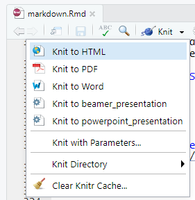

# Allgemeines

Mit R Markdown Dokumenten lassen sich Datenanalysen dokumentieren. R Markdown Dokumente umfassen sowohl den zur Analyse verwendeten Programmcode als auch die ergänzenden Textpassagen und Erklärungen.

R Markdown Dokumente sind für sich genommen erstmal einfache, unformatierte Textdokumente. Darin enthalten sind aber Anweisungen, wie mit dem Text zu verfahren ist, die sogenannte R Markdown Syntax. Mit der R Markdown Syntax wird festgelegt:

* Einerseits welcher Text als R Befehl ausgeführt werden soll und dabei insbesondere
  + ob nur die Ergebnisse oder auch die Befehle selber dargestellt werden ,
  + in welcher Form die graphische Ausgabe dargestellt werden sowie
  + ob und wie eine Interaktion mit dem Nutzer erfolgt
* Andererseits welcher Text als erklärender Text ausgegeben soll und dabei insbesondere
  + wie der Text strukturiert ist (Überschriften, Listen,..),
  + wie der Text formatiert ist (Schriftart und -größe, ...) sowie
  + ob und welche ergänzenden Elemente vorhanden sind (Fußnoten, Bilder,...).

## Beispiel: R Tutorials

R Markdown ist Ihnen bereits bekannt. Die in diesem Kurs verwendeten interaktiven R Tutorials wurden als R Markddown Dokumente erstellt. Allerdings haben Sie bislang nur die Ergebnisse gesehen - in Form von html Seiten. In diesem Abschnitt wird gezeigt, wie sich R Markdown nutzen lässt, um selber  Dokumente in verschiedenen Formaten zu erstellen.

Auch dieses Tutorial wurde als R Markdown Dokument erstellt und anschließend als .html exportiert. Die Originaldatei kann hier heruntergeladen werden:
[R Notebook](./markdown.Rmd)

## Installation

R Markdown ist Bestandteil des `rmarkdown` Paketes von RStudio. Die Installation erfolgt mittels:

```{r, echo = T, eval = F}
install.packages("rmarkdown") 
library("rmarkdown")
```

Wenn Sie PDF Dokumente erstellen wollen, benötigen Sie zusätzlich noch eine lauffähige LaTeX-Umgebung. Wenn Sie diese noch nicht installiert haben, können Sie dies über das Paket `tinytex` nachholen.

```{r, echo = T, eval = F}
install.packages("tinytex") 
tinytex::install_tinytex()
```

Der Befehlsaufruf ìnstall_tinytex()` installiert dabei die LaTeX-Umgebung TinyTeX. 


## Hilfestellung und Referenz

Mehr Informationen finden sich auf der [englischsprachigen Seite des Projekts](https://rmarkdown.rstudio.com).

Eine Übersicht findet sich auch in dem [rmarkdown-cheatsheet](https://github.com/rstudio/cheatsheets/raw/master/rmarkdown-2.0.pdf).

Eine umfangreiche Einführung in die Verwendung von R Markdown zum Erstellen verschiedener Dokumenttypen findet sich in dem Online Buch [R Markdown: The Definitive Guide](https://bookdown.org/yihui/rmarkdown/).

# R Markdown Syntax

## Aufbau von R Markdown Dokumenten

Ein R Markdown Dokument besteht aus drei Grundbausteinen:

* Kopfzeile (header) mit Angaben zum Dokumenttyp, Autor, etc. - optional
* Textbausteinen
* Programmcode

Standardmäßig werden alle Textzeichen als Textbaustein interpretiert. Die beiden anderen Bausteine muss man durch Sonderzeichen kenntlich machen.

* Die Kopfzeile wird mit `---` eingeleitet und mit `---` beendet.
* R-Programmcode wird mit ` ```{r} ` eingeleitet und mit ` ``` ` beendet.

Ein einfaches Markdown Dokument mit allen drei Bausteinen sieht damit so aus:

````
--- 
title: "Ein einfaches R Markdown Dokument"
output: html_notebook
---

Zu Beginn kam die Kopfzeile. Dies ist ein einfacher Textbaustein. Im folgenden berechnen wir den natürlichen Logarithmus von 20 in einem Programmcodeblock mit R: 

`r ''```{r}
ln(20)
```

(Dieser Text und die letzten dreifachen Anführungszeichen gehören nicht dazu. Sie sind nur dazu da, dass die voranstehenden Befehle nicht interpretiert werden und die RStudio GUI nicht durcheinander kommt.)
``` 
````

Sie können Textbausteine und Programmcodeblocks nun in beliebiger Häufigkeit und Anordnung aneinander reihen. Fertig ist das R Markdown Dokument.

## Kopfzeile

Die Kopfzeile ist optional. Sie enthält unter anderem Angaben zum Dokument, seiner Erstellerin und dem gewünschten Ausgabeformat im YAML Format.

Die Angaben werden durch die Zeichenkette `Parameter: Wert` festgelegt. Beispiele sind:

* `output :` Legt das gewünschte Ausgabeformat fest. Mögliche Werte sind unter anderem:
  + `html_document` für HTML
  + `pdf_document` für PDF
  + `word_document` für MS Word
  + `beamer_presentation` für eine LaTeX (beamer) Präsentation
  + `powerpoint_presentation` für eine MS Powerpoint Präsentation
  + `learnr::tutorial` für interaktive R Tutorials
* `author :` Name der Erstellerin bzw. des Erstellers
* `title : ` Titel des Dokuments


## Textformatierung

R Markdown verfügt über vielfältige Möglichkeiten, um Text zu formatieren und zu strukturieren. Darunter finden sich die meisten regelmäßig verwendeten Formatierung wie z.B. Überschriften, Listen, etc. Spezielle Formatierungen wie z.B. zweispaltiger Textsatz oder spezielle Zeilenabstände sind nicht möglich.


Einfacher Text wird ohne Änderungen dargestellt. 
Ein einfacher Zeilenumbruch führt zu einem einfachen Zeilenumbruch.

Ein Zeilenumbruch mit Leerzeile (alternativ zwei Leerzeichen am Zeilenende) führt zu einem neuen Absatz.

Um die weitergehende Struktuerirung und Formatierung des Textes zu kennzeichnen, verwendet die R Markdown Syntax Sonderzeichen.


### Schriftformatierung

Bettet man Text in Sternchen `*kursiv*` so erscheint er *kursiv*.

Bettet man Text in Doppelsternchen `**fett**` so erscheint er in **Fettdruck**.

Will man Text ohne Formatierung anzeigen (sog. `verbatim`), dann bettet man ihn in einfache \`-Anführungszeichen.

Mathematische Gleichungen (in LaTeX-Syntax) lassen sich durch Einbettung in \$-Zeichen erreichen `$\frac{1}{2}$` ergibt $\frac{1}{2}$.

Weitere Formatierungen (Hoch-/Tiefstellen etc.) findet sich auch im [rmarkdown-cheatsheet](https://github.com/rstudio/cheatsheets/raw/master/rmarkdown-2.0.pdf).


### Strukturierung von Dokumenten

Die Strukturierung des Textes in Gliederungsebenen erfolgt durch Überschriften.

Eine Überschrift der ersten Ebene lässt sich mit dem Rautzeichen `#` erstellen. Eine Überschrift der zweiten Ebene mit zwei Rautezeichen `##`. Im folgenden eine Überschrift der vierten Ebene mit vier Rautezeichen `#### Vierte Gliederungsebene`.

#### Vierte Gliederungsebene

Listen werden stets als eigener Absatz erzeugt und sind in Einrückungsebenen geglieder. Einen Listeneinträge auf der obersten Ebene erstellt man mit `*`, einen auf der nächsten Ebene mit `+` und einen auf der dritten Ebene mit `-`. Den Einträgen muss man jeweils eine Tabulator-Einrückung voranstellen (Taste links vom q)

So ergibt:

````
* erste Ebene
  + zweite Ebene
    - dritte Ebene
  + nochmal zweite Ebene
````
die folgende Liste:

* erste Ebene
  + zweite Ebene
    - dritte Ebene
  + nochmal zweite Ebene

Nummerierte Listen erhält man entsprechen durch Voranstellen der Nummerierungszeichen - entweder arabisch oder römisch - gefolgt von einem Punkt. Zusätzlich muss man eine doppelte Einrückung vornehmen - zweimal die Tabulator Taste drücken.

So ergibt:
````
1. erste Ebene
    i. zweite Ebene
      1. dritte Ebene
    ii. nochmal zweite Ebene
````
(beachten Sie die doppelte Einrückung gegenüber der einfachen Liste) die folgende Liste:

1. erste Ebene
    i. zweite Ebene
        1. dritte Ebene
    ii. nochmal zweite Ebene

Will man numerierte Listen erstellen, die nach einer Unterbrechung durch einen Textabsatz weiter fortgeführt werden, so stellt man `(@)` voran. 


So ergibt:
````
(@) erster Listeneintrag

und dazwischen kommt Text

(@) zweiter Listeneintrag

````
die folgende Ausgabe:

(@) erster Listeneintrag

und dazwischen kommt Text

(@) zweiter Listeneintrag


Weitere Möglichkeiten den Text zu strukturieren (Definitionen, Zitate, Fußnoten etc.) finden sich im [rmarkdown-cheatsheet](https://github.com/rstudio/cheatsheets/raw/master/rmarkdown-2.0.pdf).


### Verlinkungen, Bilder, etc.

R Markdown bietet einfache Möglichkeiten, um Verweise hinzuzufügen. 

#### Links
Einen URL-Link erzeugt man 

* direkt mit Angabe des Protokolls `<https://rmarkdown.rstudio.com>` als <https://rmarkdown.rstudio.com>
* oder als benannten WWW-Link mit `[Projektseite R Markdown](rmarkdown.rstudio.com)` als [Projektseite R Markdown](rmarkdown.rstudio.com).

#### Graphiken
Eine Graphik lässt sich ähnlich wie ein Link einbetten durch ein zusätzliches vorangestelltes Ausrufezeichen mit
`{width=10%}`

{width=10%}

Das geht auch für Graphiken im Netz unter Angabe der entsprechenden URL bspw.: `{width=50px}` als

`{width=50px}`

Der Text in den eckigen Klammern dient dabei als Bildunterschrift.

## Programmcode

Eine Programmcodeblock wird mit dem dreifachen Anführungszeichen eingeleitet. Anschließend folgt in geschweiften Klammern die Angabe der Programmiersprache.

````

`r ''````{r}
# hier kommt der Programmcode rein

``` 


(Dieser Text und die letzten dreifachen Anführungszeichen gehören nicht dazu. Sie sind nur dazu da, dass die voranstehenden Befehle nicht interpretiert werden und die RStudio GUI nicht durcheinander kommt.)
```
````

Innerhalb des Programmcodesblocks können beliebige R-Befehle ausgeführt werden. Dabei werden alle Befehle in den Programmcodeblocks in einem R Markdown Dokument hintereinander ausgeführt. Spätere Codeblocks können damit auf die Ergebnisse früherer Codeblocks zugreifen, z.B. auf Variablen, die in vorangehenden Blocks erzeugt wurden. 

Sofern die Befehle Funktionen aus speziellen Paketen beinhalten, so müssen diese vorher entsprechend eingebunden werden (`library()`).

Startet man einen Programmcodeblock so kann man durch weitere Argumente festlegen, wie dieser weiter verarbeitet werden soll. Die Argumente werden dabei in die geschweiften Klammern geschrieben und mit Kommas abgetrennt. Wenn einzelne Argumente nicht explizit angegeben werden, gelten die Standardwerte. 


Die wichtigsten beiden Argumente sind:

* `echo =` soll der R-Code in der Ausgabe sichtbar sein (oder nur die Ergebnisse) - Auswahl zwischen `TRUE` (Standard) und `FALSE`,
* `eval = ` soll der R-Code ausgeführt werden - Auswahl zwischen `TRUE` (Standard) und `FALSE`

Zur Demonstration im folgenden ein Beispiel für einen Programmcodeblock, der angezeigt, aber nicht ausgeführt wird:

````

`r ''````{r, eval = FALSE, echo = TRUE}
plot(1:5)


``` 


(Dieser Text und die letzten dreifachen Anführungszeichen gehören nicht dazu. Sie sind nur dazu da, dass die voranstehenden Befehle nicht interpretiert werden und die RStudio GUI nicht durcheinander kommt.)
```
````
ergibt folgende Ausgabe im Dokument:

```{r, eval = FALSE, echo = TRUE}
plot(1:5)
``` 


Und ein Beispiel für einen Programmcodeblock, der nicht angezeigt, aber ausgeführt wird:

````

`r ''````{r, eval = TRUE, echo = TRUE}
plot(1:5)


``` 


(Dieser Text und die letzten dreifachen Anführungszeichen gehören nicht dazu. Sie sind nur dazu da, dass die voranstehenden Befehle nicht interpretiert werden und die RStudio GUI nicht durcheinander kommt.)
```
````

```{r, eval = TRUE, echo = FALSE}
plot(1:5)

``` 


# Erstellen von Ausgabedokumenten

Dokumente im R Markdown Format werden zunächst mit Hilfe des Pakets `knitr` in allgemeines Markdown Format `md` umgewandelt. Anschließend wird dieses mit `pandoc` in das gewünschte Format umgewandelt. 

Dieser Prozess kann entweder auf der Kommandozeile aufgerufen werden, oder in der RStudio GUI als Menübefehl ausgewählt werden.

## Erstellen mittels `render()`

Die Funktion `render()` aus dem `markdown` Paket übersetzt eine R Markdown Datei - `input = ` in das gewünschte Ausgabeformat `output_format = `, sofern gewünscht mit dem Dateinamen `output_file = `.

Die Angabe des Ausgabeformats erfolgt als Zeichenkette z.B. `"html_document"` oder als Ausgabeobjekt bzw. -funktion z.B. `html_document()`. Die möglichen Werte entsprechen dabei denen in der Kopfzeile des R Markdown Dokuments.

Alternativ lässt sich durch Angabe von `output_format = "all"` auch bewirken, dass alle in der Kopfzeile spezifizierten Ausgabeformate erzeugt werden.

## Erstellen mittels RStudio GUI

Die Rstudio GUI bietet für R Markdown Dokumente unter dem Menüeintrag `Knit`:

{width=50%}


ein Auswahlmenü mit den möglichen Zielformaten:

{width=30%}

Dieses enthält standardmäßig 
* `Knit to HTML`
* `Knit to PDF`
* `Knit to Word`

Sofern in der Kopfzeile auch weitere Ausgabeformate festgelegt wurden, erscheinen diese ebenfalls im Auswahlmenü, hier:

* `Knit to beamer_presentation`
* `Knit to powerpoint_presentation`

Ein Klick auf das gewünschte Ausgabeformat startet den Prozess. 

## Ausgabeformate

### HTML

HTML Dokumente werden durch Angabe von `output : html_document` erstellt.

HTML ist das Standardausgabeformat für R Markdown. Entsprechend bietet R Markdown für HTML Dokumente erweiterte Formatierungsmöglichkeiten. Diese werden in der Kopfzeile nach der Angabe von `output: html_document` festgelegt. Die beiden wichtigsten sind:

* `toc : true` es wird ein Inhaltsverzeichnis erstellt (Standard `false`)
* `number_sections : true ` die Überschriften werden nummeriert (Standard `false`)


### R Notebook (html)

R Notebooks werden durch Angabe von `output : html_notebook` erstellt.

Das Notebook dient dem fortlaufenden Protokollieren von Arbeitsergebnissen in der Datenanalyse mit R. Die R Analysen werden dabei als einzelne Programmcodeblöcke durchgeführt und fortlaufend durch Text davor bzw. danach kommentiert und diskutiert. 

Durch das Notebookformat entfällt die klassische Trennung zwischen der Analyseanweisung an den Computer in Form von Programmcode (z.B. R-Skripte) und der Analyseerklärung durch Texte in Form eines Textdokuments.


### PDF Dokument

PDF Dokumente werden durch Angabe von `output : pdf_document` erstellt.

Sie bieten ebenso wie HTML erweiterte Formatierungsmöglichkeiten, unter anderem

* `toc : true` es wird ein Inhaltsverzeichnis erstellt (Standard `false`)
* `number_sections : true ` die Überschriften werden nummeriert (Standard `false`)

Um aus einem R Markdown Dokument ein PDF-Dokument zu erzeugen, müssen Sie über eine lauffähige LaTeX-Umgebung verfügen (siehe oben unter Installation).

### Word Dokument

PDF Dokumente werden durch Angabe von `output : word_document` erstellt.

Für Word-Dokumente lassen sich ebenso wie für HTML und PDF Dokumente erweiterte Formierungsmöglichkeiten einstellen - insbesondere `toc` und `number_sections`. 

Sofern bei der Erstellung des Word-Dokuments eine Formatvorlage verwendet werden soll - in Form einer `mystyle.docx` Datei, so kann diese mit dem Parameter `reference_docx: mystyle.docx` angegeben werden.  

### LaTeX (beamer) Präsentation

Eine LaTeX (beamer) Präsentation wird durch Angabe von `output : beamer_presentation` erstellt.

Die Einteilung des Textes in Folien erfolgt grundsätzlich anhand der Überschriften. Dabei wird standardmäßig für die Einteilung in Folien die unterste Überschriftenebene verwendet, d.h. die Überschriftenebene auf die keine weitere Überschriftenebene mehr folgt. Dies lässt sich durch den Parameter `slide_level : ` auch manuell anpassen.

Durch das Einfügen von drei aufeinanderfolgenen Minus-Zeichen (`---`) kann man gezielt eine neue Folie erstellen.

### Powerpoint Präsentation


Eine Powerpoint-Präsentation wird durch Angabe von `output : powerpoint_presentation` erstellt.

Die Einteilung des Textes in Folien erfolgt wie bei einer LaTeX (beamer) Präsentation anhand der Überschriften (inkl. Parameter `slide_level: ` und durch die Zeichenkette (`---`) zum Einfügen einer neuen Folie.


### Interaktive Dokumente

R Markdown Dokumente lassen sich auf vielerlei Arten in interaktive Dokumente überführen. 

Als Beispiel wurden bereits interaktive R-Tutorials genannt. Darüberhinaus sind auch HTML-Widgets (über JavaScript Bibliotheken) möglich oder Shiny-Applikationen.


# Beispiel

Zur Illustration der unterschiedlichen Ausgabeformate wurde dieses Dokument in verschiedene Ausgabeformate übersetzt. Dabei wurden wenn nötig spezielle Parameter gesetzt aber sonst keine Anpassungen an die Formatierung vorgenommen. Im Einzelnen:

````
---
title: "R Markdown"
author: "Rainer Stollhoff"
output:
  powerpoint_presentation:
      slide_level: 3
  pdf_document: 
      toc: true
  beamer_presentation:
      slide_level: 3
      toc: true
  html_document:
    toc: true
    df_print: paged
  word_document: default
description: Einführung in die Erstellung von Dokumenten mit R Markdown
---

````
      

* [HTML-Dokument](./markdown.html)
* [PDF-Dokument](./markdown.pdf)
* [Word Dokument](./markdown.docx)
* [Beamer Präsentation](./markdown_beamer.pdf)
* [Powerpoint Präsentation](./markdown.pptx)

Die fehlende weitere Anpassung führt bei den beiden Präsentationsformaten zu einer unvollständigen Aufteilung der Textinhalte auf die Folien. Diese dienen daher hier nur zu Demonstrationszwecken. Im tatsächlichen Einsatz würde man die Folien durch manuelle Anweisung (`---`) gliedern. 

